# Mount Baker Climate Laboratory

**iButtons, Deployment and Collection, Data Munging, and Data Quality**

### Introduction
Here we describe details about the iButtons, their deployment and collection, how the data are processed, and then an assessment of overall data quality.

These pages are a living record of this process. Code and figures associated with these results will always be linked to each result. 

Please provide feedback on any aspect of this work, whether something in error or something to celebrate.

### iButton DS1921G-F5 — Temperature Data Logger

The **DS1921G-F5** iButton is a rugged, compact temperature logger designed for reliable monitoring in harsh environments.

#### Specifications

- **Measurement Range**: –40°C to +85°C  
- **Accuracy**: ±1°C (from –30°C to +70°C)  
- **Resolution**: 0.5°C  
- **Memory Capacity**: 2,048 time-stamped temperature readings  
- **Sampling Interval**: Programmable from 1 minute to 255 minutes  
- **Data Retention**: >10 years (non-volatile memory)  
- **Battery Life**: ~10 years (built-in, non-replaceable battery)  
- **Interface**: 1-Wire®

#### Key Features

- Durable stainless steel housing  
- Suitable for long-term deployment  
- Compatible with 1-Wire® communication systems  
- Timestamped logging with programmable alarm thresholds

### MBCL Deployment and Collection

There are several aspects of the deployment and collection of the iButtons relevant and necessary for any **Citizen Scientist** to interpret the raw temperature data provided here.

#### iButton Settings
We have set the **frequency** of measurement to be **255 min between measurements** with **no rollover** once measurement capacity is reached. With a maximum capacity of 2048 measurements on each sensor, this means that each sensor can collect **~362.7 days of data** continuously. 

#### Deployment and Collection Logistics
The sensors are deployed and collected **annually** at the same time in partnership with the Lakeside School Outdoor Program (LSOP). Typically three adults and nine students participate in this trip, and record their actions (most of the time) in field logbooks available here. 

*Trip and Sensor Logistics*: The sensors are initialized with minimum frequency (255 min/measurement) between 1-3 days before handoff to the student group. The sensors are placed in separate small, anti-static bags by Site number. All these small bags are placed in a larger (30 cm 30 cm) handoff package with helpful field equipment. 

The handoff to the student group occurs at their bag check **one day before** their approach begins. The students spend three days on the mountain training and summitting. The spend two days leaving. All sensors are deployed or collected on the ascent (i.e., during the first three days of the trip).

*The Route*: LSOP follows the typical southern ascent of Mount Baker starting and Schriebers Meadow, up the Railroad Grade, through the Portal, to the Crater Rim, and then Summit. 

*Exceptions*: to this timing occurred during the COVID period when there was a delay in receiving sensor orders, or the student trip was canceled. (Need dates here)

#### Data Munging
*Data Interpretation Notes*: Based on the deployment and collection logistics, there are several useful pieces of information for interpreting the data. 

The sensors are annually deployed and collected at the same time (usually). As the sensors are transported to and from the mountain in the same bag, their temperatures should be very close to each other prior to deployment and after collection. If collection happens after 362.7 days, then the sensors will time out - so there would be no indication of when they were all put in the bag together.

##### Identification of deployment and collection dates
Below we generate a list of the deployment and collection dates. These are then cross-referenced with the dates from the field logbooks. 

The following information is useful in this exercise:
1. Sensors are transported together in a bag (full of smaller bags)
2. Sensors are deployed completely by three days after arrival to Schriebers Meadow (the first deployment site)
3. Sensors have an accuracy of approximately +/- 1C. 
4. Sensors tend to fill completely before collection.

The following figures show all temperature sensors from the beginning and end of each field deployment, along with the standard deviation of all temperature sensors. Deployments and collection almost always occurred at the same time, and in July.

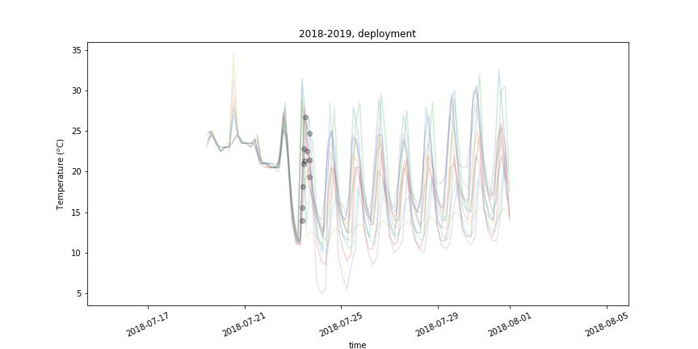

**Figure 1.** *All temperatures during deployment of sensors during July 2018.*

**Figure 2.** *Standard deviation of temperatures during deployment of sensors, July 2018.*

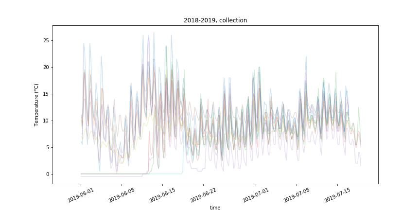

**Figure 3.** *All temperatures during collection of sensors, July 2019.*

**Figure 4.** *Standard deviation of temperatures during collection of sensors, July 2019.*

**Figure 5.** *All temperatures during deployment of sensors during July 2019.*

**Figure 6.** *Standard deviation of temperatures during deployment of sensors, July 2019.*

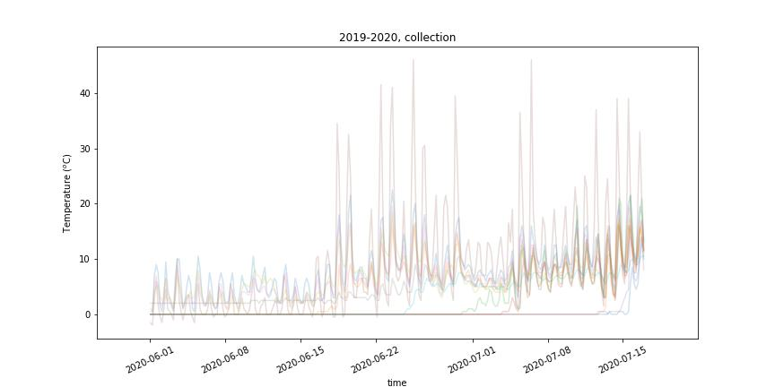

**Figure 8.** *All temperatures during collection of sensors, July 2020.*

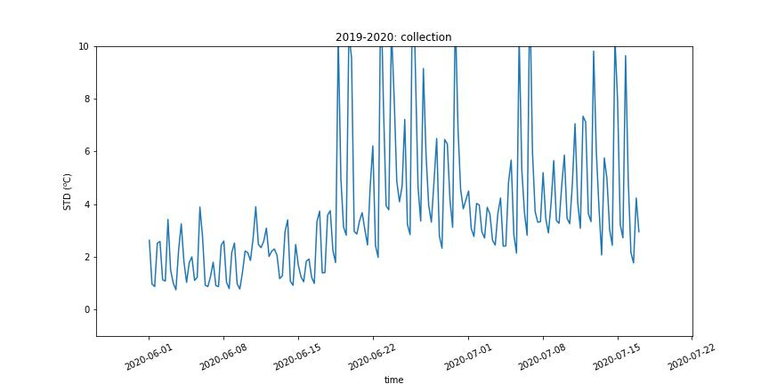

**Figure 8.** *Standard deviation of temperatures during collection of sensors, July 2019.*

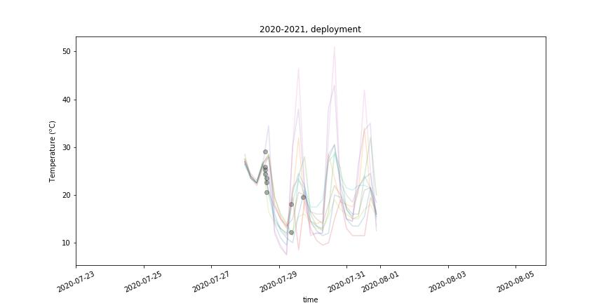

**Figure 9.** *All temperatures during deployment of sensors during July 2020.*

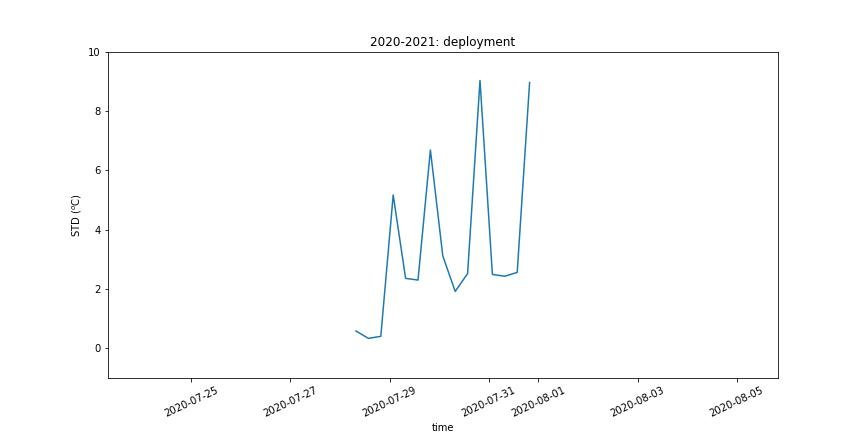

**Figure 10.** *Standard deviation of temperatures during deployment of sensors, July 2020.*

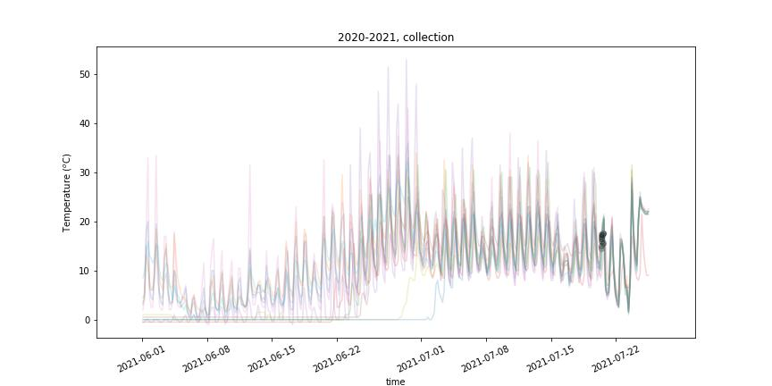

**Figure 11.** *All temperatures during collection of sensors, July 2021.*

**Figure 12.** *Standard deviation of temperatures during collection of sensors, July 2021.*

**Figure 13.** *All temperatures during deployment of sensors during July 2021.*

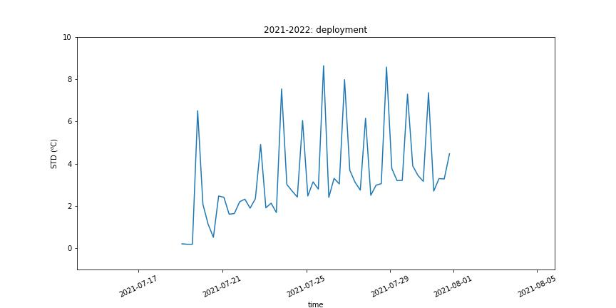

**Figure 14.** *Standard deviation of temperatures during deployment of sensors, July 2021.*

**Figure 15.** *All temperatures during collection of sensors, July 2022.*

**Figure 16.** *Standard deviation of temperatures during collection of sensors, July 2022.*

**Figure 17.** *All temperatures during deployment of sensors during July 2022.*

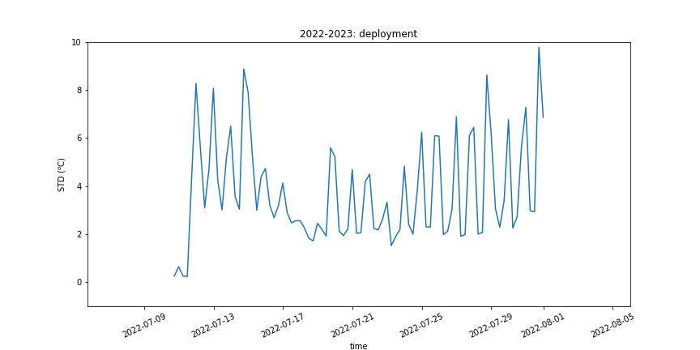

**Figure 18.** *Standard deviation of temperatures during deployment of sensors, July 2022.*

**Figure 19.** *All temperatures during collection of sensors, July 2023.*

**Figure 20.** *Standard deviation of temperatures during collection of sensors, July 2023.*

**Figure 21.** *All temperatures during deployment of sensors during July 2023.*

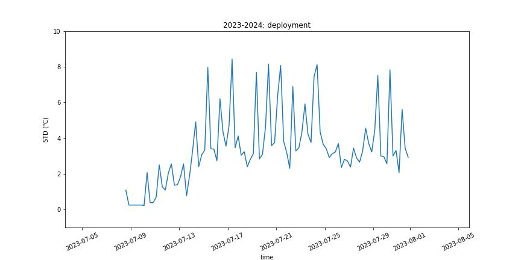

**Figure 22.** *Standard deviation of temperatures during deployment of sensors, July 2023.*

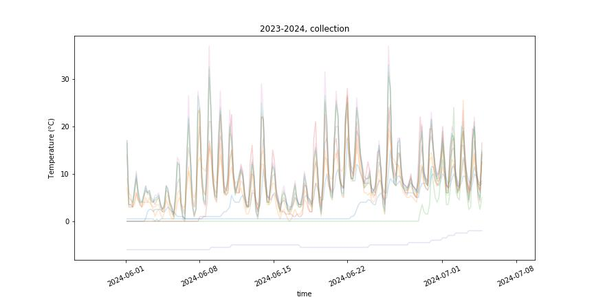

**Figure 23.** *All temperatures during collection of sensors, July 2024.*

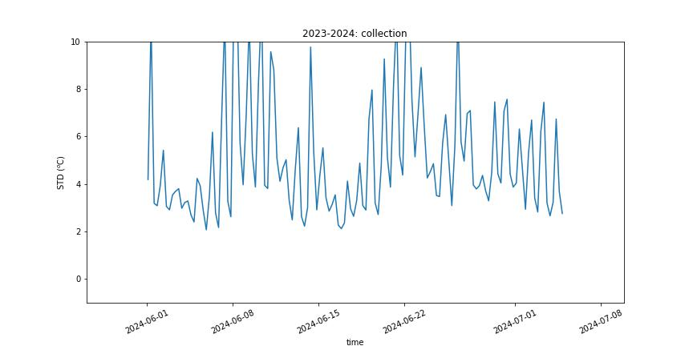

**Figure 24.** *Standard deviation of temperatures during collection of sensors, July 2024.*
