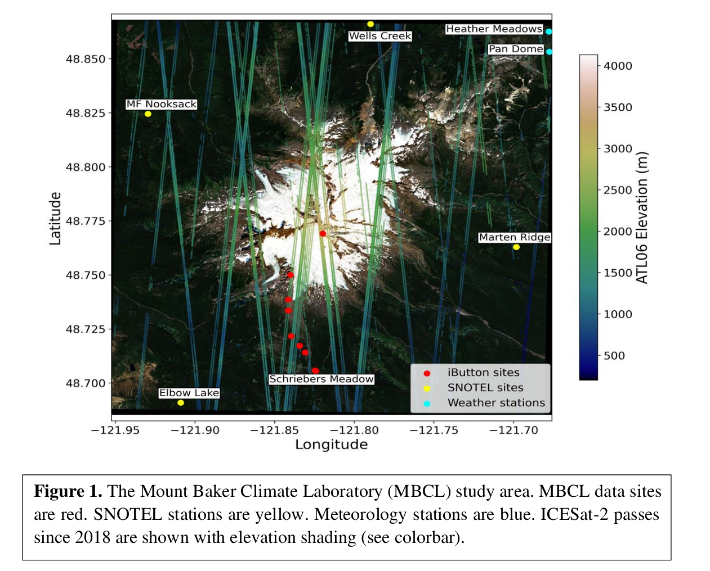

# The Mount Baker Climate Laboratory (MBCL)

**Mountain climate science co-created by citizen and professional scientists**

Our mission is to inclusively and openly answer climate questions about Mount Baker relevant to local and regional communities. 

### What is the MBCL?

This is a collaborative project in which citizen scientists and professional scientists co-create understanding about the climate of Mount Baker using a combination of *in situ* and satelitte measurements. We ask provide data and ask questions relevant to the hydrologic health and welfare of this important environmental system. 

#### How does the MBCL work?

The MBCL is a result of ongoing partnerships between several organizations (Table 1). Its foundation comes from ongoing measurements of temperature at nine sites along the southern ascent of Mount Baker. These temperature measurements are made in distributed arrays from which we can derive much more than simply an understanding of local temperature patterns and trends. The arrays of temperature 

##### Table 1. MBCL Institutional Partners

| Institution | Role |
| ------------- | ------------- |
| Adventure Data | *In situ* snow measurements |
| Earth and Space Research | Lead institution, data analysis, citizen scientist education |
 

### Contributors

| Name | Institution | Role | Contribution | Contact |
| ------------- | ------------- | ------------- | ------------- | ------------- |
| Sky Gale | University of Washington | Professional Scientist  |  Lapse rate investigations | skycgale@uw.edu |
| Daniel Howard | NCAR | Professional Scientist | Lapse rate investigation  | dhoward@ucar.edu |
| Susan Howard | Earth and Space Research  | Professional Scientist  | ICESat2 | showard@esr.edu |
| Miles L | Lakeside School | Citizen Scientist | Lapse rate/ML investigation| MilesL25@lakesideschool.org |
| C. Max Stevens | University of Maryland | Professional Scientist | ICESat2 | maxstev@umd.edu |
| Michael (Mike) Town | Earth and Space Research | Professional Scientist | Project Lead | michael.town@esr.org |
| Felicity W | Lakeside School/Earth and Space Research | Citizen Scientist | Lapse rate investigation/Ecosystem health | felicityw26@lakesideschool.org |

### Questions We are Asking
1. How can we use Mt. Baker lapse rates to study changes in the ecosystem?

### Interested in Contributing
If you are interested in contributing or have any questions, please reach out to michael.town@esr.org.

### Land Acknowledgement
We respectfully acknowledge that we learn, live, reflect, teach, and observe on the
ancestral homelands of Tribes, Bands, and First Nations, including Coast Salish, Lower
Skagit, and Upper Skagit.

We would like to express respect and gratitude for our Indigenous neighbors for their
care and protection of our shared lands and waterways and celebrate the resilience and
strength that Indigenous peoples have shown and continue to show.

To acknowledge this land we share, study, and value is to critically reflect on a history that includes disease,
displacement, violence, and loss of land, and to recognize our place in that history.
We offer this acknowledgement as an important step in honoring the relationship with land we
share, and a call towards further learning and action.
